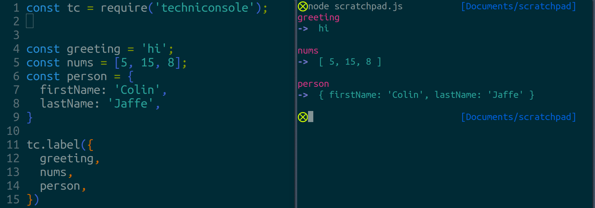

# Techniconsole

A console alternative that will (eventually):

* wrap each environment's `console` object so that you can still use it and
* be thoroughly extensible so that I may profit (spiritually) from others' work.


### Okay, But What's There Now

This:




### Installation

In your terminal:

```bash
npm install techniconsole
```

Then in your JavaScript:

```javascript
const tc = require('techniconsole'); // Or really call the variable whatever you want!

const someVariable = 'some value';
const anotherVariable = 'another value';
const severalValues = ['one', 'after', 'another'];

tc.label({someVariable}); // For just one value.

// Several values serially:
tc.label({
  anotherVariable,
  severalValues,
});
```


### Will There Be More?

Yes. Soon!

(-ish)
