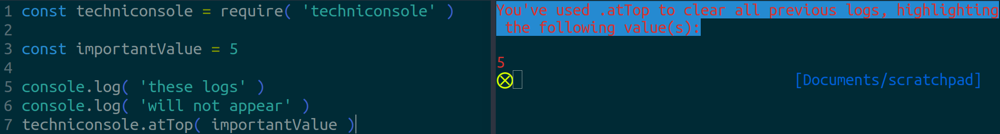

# Techniconsole

A set of easy-to-use `console.log` alternatives for clearer code demonstrations.

- [Installation](#installation)
- [Introduction - What's Wrong With console.log?](#introduction-whats-wrong-with-consolelog)
- [Design Principles](#design-principles)
- [Methods](#methods)
    + [withLabel](#withlabel)
    + [asBanner](#asbanner)
    + [atTop](#attop)
- [On Variable Names And Clarity](#on-variable-names-and-clarity)
- [Roadmaps For Future Versions](#roadmaps-for-future-versions)
- [Contributing](#contributing)


<a name="installation"></a>
# Installation

In the working directory of an `npm`-controlled project: 

```bash
npm install techniconsole --save-dev
```


<a name="introduction-whats-wrong-with-consolelog"></a>
# Introduction - What's Wrong With console.log?

I mean... _everything_ is wrong with `console.log`, right? 

It's particularly poor as a debugging tool, but it often tricks developers, especially new ones, into thinking it is, instead, a great one.

But even if you're going to use it more to peek at a value and then delete the log, or to demonstrate a code technique or tool, rather than debugging), its plain-text approach can lead to some very difficult-to-parse output in the following ways:

1. It tends to blend in with the terminal's info-dump, making it hard to find what you're trying to log out. More like `console.needleInAHaystack`, amirite?
2. If you care about the _other_ information in the terminal, well, every console.log makes that harder to find.
3. Once you have a few more of them, you get a brand new parsing task: telling one logged value from another.

A common solution to parsing your logging is to make sure each one is labeled in some way, which requires `console.log` usage like the following increasingly effective but verbose examples:

```javascript
console.log('The value of foo is: ', foo)

// Or, slightly easier to parse because it's on two lines:
console.log('The value of foo is:')
console.log(foo)

// And, to make it easier to parse from the other terminal output:
const colors = require('colors')

console.log(colors.cyan('The value of foo is:'))
console.log(colors.magenta.bold(foo))
```

And now, gradually, you're getting to the point where you're looking for a keyboard shortcut or extension or macro to input all this extra _code_ for you.

Since I'm so often trying to do a quick-and-dirty look at a certain value, particularly when demonstrating code to others, at a certain point it made sense to make this its own function. And then it made sense to make it a shareable module. And then I started to ask: what other log-parsing problems could such a module solve?

And so: this library.


<a name="design-principles"></a>
# Design Principles

Techniconsole is a set of `console.log`-style methods specifically designed to produce a clear signal in a noisy console world. It achieves this through three basic design principles:

  1. Solve actual problems. For example: labelling what value you're logging is an annoying task and an unnecessary pain point.
  2. Use style and formatting in a way that complements the purpose of each use-case. For example: if you're marking a section of your logs with a header, we want that mark to be… remarkable. Center it, make it full-width, capitalize everything, and by all means, colorize it like you _mean_ it.
  3. Require no set-up. There is no configuration needed for this library. Nor, for the most part, is any possible. This is a highly opinionated set of methods for displaying the results of code, and we've developed it so that _you_ don't have to waste your time re-inventing or even tinkering with the logging wheel. (Like... we did.)


<a name="methods"></a>
# Methods
  
<a name="withlabel"></a>
### withLabel

`withLabel` takes in an object and logs the keys as labels for the values.

You can use this for one-shot logs:


The object that `withLabel` takes in can have more than one property, meaning you can log several key/value pairs in one call:


Since keys are just strings, you can be more verbose about it:


Or, going the other way, a common pattern is to label values in a succinct way using object property shorthands:


<a name="asbanner"></a>
### asBanner

`asBanner` takes in a message (usually as a string, but any other type is converted) and prints it out as a banner for either demarcating one section from another or calling attention to a particular log (although see [atTop](#atTop) for a better alternative to singling out one log). It has the following attention-grabbing features:

* The banner is full-width, even if the message isn't. Spans the entire width of the terminal window (or close to it).
* The banner and text are each in different neon, hard-to-miss colors.
* All text is centered and uppercased.


* And the final formatting feature: all text is wrapped without breaking words.


You can manually control what should go in each row of a banner by passing in a separate string for each row.


Of course, if one of your intended rows exceeds the width of the display space, it will still be automatically wrapped.


<a name="atTop"></a>
### atTop

A simple method that will clear all logging above it so that the logged value appears at the very top of the terminal. Great for temporarily highlighting values, with a built-in reminder of _why_ you're not seeing other logs:



Please note that `atTop` does _not_ clear any logs below it:


And you can always pass multiple values:


<a name="on-variable-names-and-clarity"></a>
# On Variable Names And Clarity
 
Did you know that you can use any name for a library you _DW please_? It's _your_ variable, no one else's! (You probably already knew this; if you didn't, it's time for a TIL tweet!)


Did you know that we have _opinions_ about which you should use? We do! The following variable names are in order of objectively worst to objectively best, so allow us to tell you our _objective_ reasoning, and then... you do you, my friend. You do you.

1. `bob` - "Hahahahahaha, they named it something _silly_. Now... uh... what does it do again? How do I use this?" What you gain in a one-time laugh you lose ten-fold in usability.
* `console` - There's an argument for this--to the point where we're constantly considering whether we should wrap the native console object so your `console.log` calls get converted to use this library--but ultimately, this library _isn't_ a drop-in replacement for `console`. Treating it as such can easily lead to a lack of clarity of where one starts and the other ends.
* `tc` - A nice short variable name, but it makes it hard for anyone seeing your code to easily grok what it does. If you've ever come back to your own code after a while, you know it's easy to forget such things yourself! Plus... you really don't need short variable names if you're using tab-completion. Are you using tab-completion? You really should be using tab-completion!
* `techniconsole` - An excellent name indeed! Whoever thought of it must be very, _very_ handsome.
* `tonsole` - We might slightly prefer this one. It's catchy--the greatest tragedy of our time is that [an excellent library](https://www.npmjs.com/package/tonsole) already grabbed the package name--and it quickly reads as a `console` alternative.

Again though, it's _your_ variable!


<a name="roadmaps-for-future-versions"></a>
# Roadmaps For Future Versions

*1.1*

* [ ] Convert style and layout to work within a browser console.

*2.0*

* [ ] Create composable versions, so that one could have a banner or labelled value on top, or a labelled value inside a banner.
* [ ] Pretty-print all objects.


<a name="contributing"></a>
# Contributing

We don't currently have a formal system yet for accepting contributions, but we're open to suggestions on this project as well as assistance setting up a formal system.
